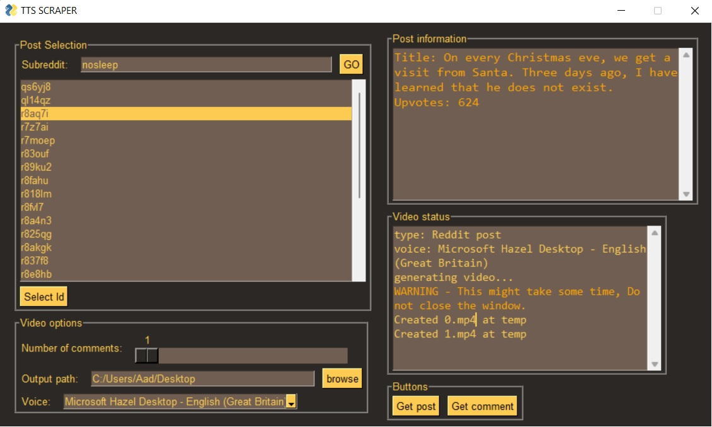
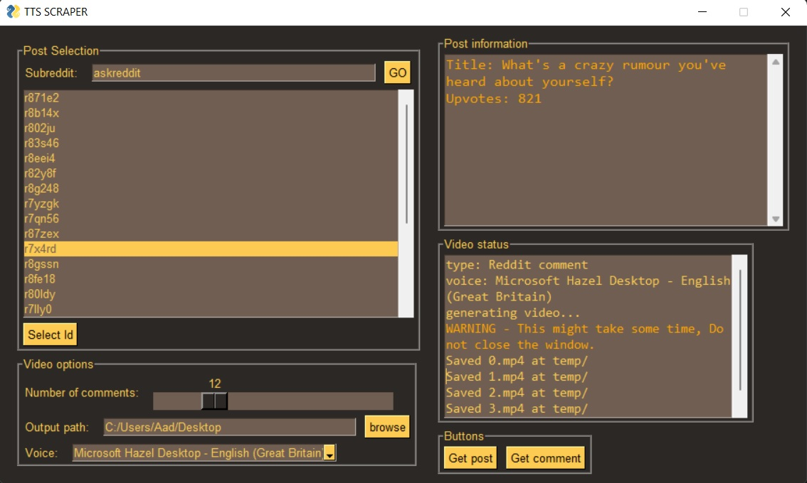

# Reddit text to speech generator

A python gui program to generate reddit text to speech videos from the id of any post.

# Current functionality

- Generate videos for subs based on comments,(askreddit) so reading individual comments.
- Generate videos for subs with longer posts,(entitledparents), so slicing the post into multiple frames to fit the text.
- Easy login, all you need to do, is run `main.py`, you will get a link; go to the link and click allow; Thats it! the credentials are written to a json file so you dont need to repeat this step as long as the `token.json` file is there.
- ALL in one gui, select the subreddit, id within one gui

# Todo

- [ ] Putting the events in their own seperate threads
- [ ] Refactors,and making `main.py` more 'DRY'
- [ ] Improving the looks of the actual video generated
- [ ] Dockerizing the application
- [ ] **Maybe** adding support for more voices (IBM Watson, Amazon TTS, Gtts)

**_This project is still in developent, if you face any issues, then contact me via email or raise an issue_**

# Usage

- do `pip install -r requirements.txt` to install all the dependencies and then, run `python main.py`
- It will prompt you to open a url, open it, then allow "post_scraper" to access your account, then you will be redirected to a browser tab, you can then close it.

# Screenshots

 

# Backburners

- Converting links and emojis to plain text
