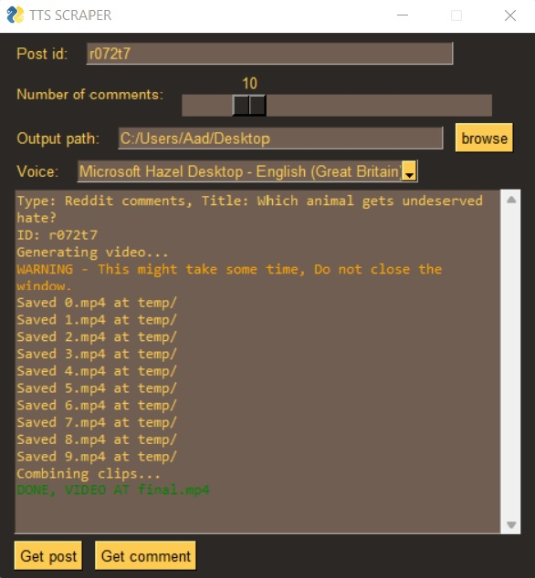
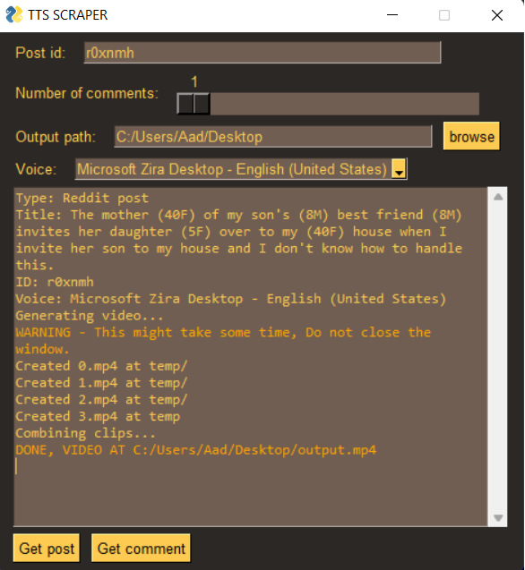

# Reddit text to speech generator

A python gui program to generate reddit text to speech videos from the id of any post.

# Current functionality

- Generate videos for subs based on comments,(askreddit) so reading individual comments.
- Generate videos for subs with longer posts,(entitledparents), so slicing the post into multiple frames to fit the text.
- Easy login, all you need to do, is run `main.py`, you will get a link; go to the link and click allow; Thats it! the credentials are written to a json file so you dont need to repeat this step as long as the `token.json` file is there.
- Optional customizability options to change the font, backdrop, position of text on the screen
# Todo

**Feel free to suggest any feature or bug via comments or issues**

- [x] Get comments based on the permalink
- [x] Generate mp3 and jpg of the post and its comments; concatenate both of them for a clip, them combine all the clip into one file
- [x] Migrate to praw
- [x] Ability to generate tts for post based subreddits (r/nosleep or r/relationships)
- Better post/comment formatting
  - [x] Nsfw filter
- Visual enhancements
  - [x] Slicing longer posts into to frames or jpg(s)
- Wrapping it all up into a nice ~~tkinter~~ pysimplegui window
  - [x] Implemented option for reading post or comments (with title)
  - [x] Output folder selection
  - [x] Voice selection
  - [x] Some clean ups and error handling

# Usage

- do `pip install -r requirements.txt` to install all the dependencies and then, run `python main.py`
- It will prompt you to open a url, open it, then allow "post_scraper" to access your account, then you will be redirected to a browser tab, you can then close it.

# Screenshots

 

# Backburners

- Converting links and emojis to plain text
